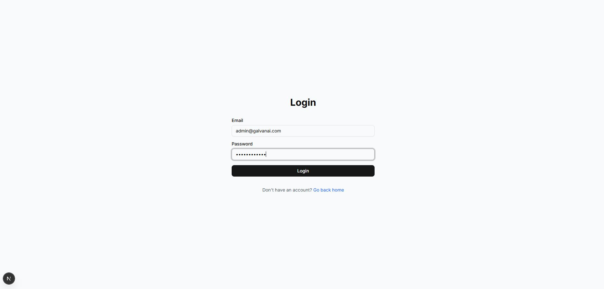
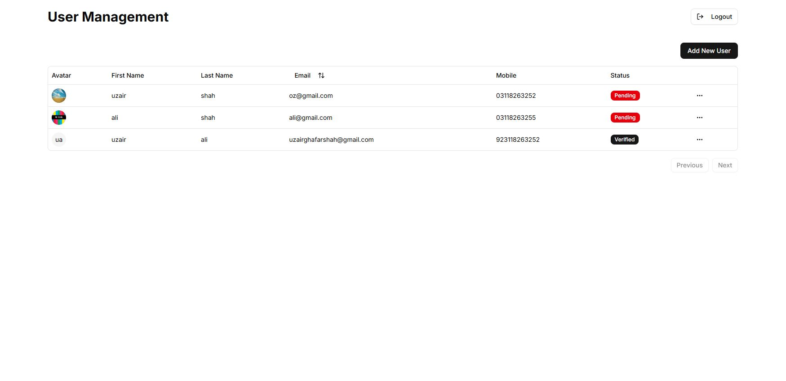
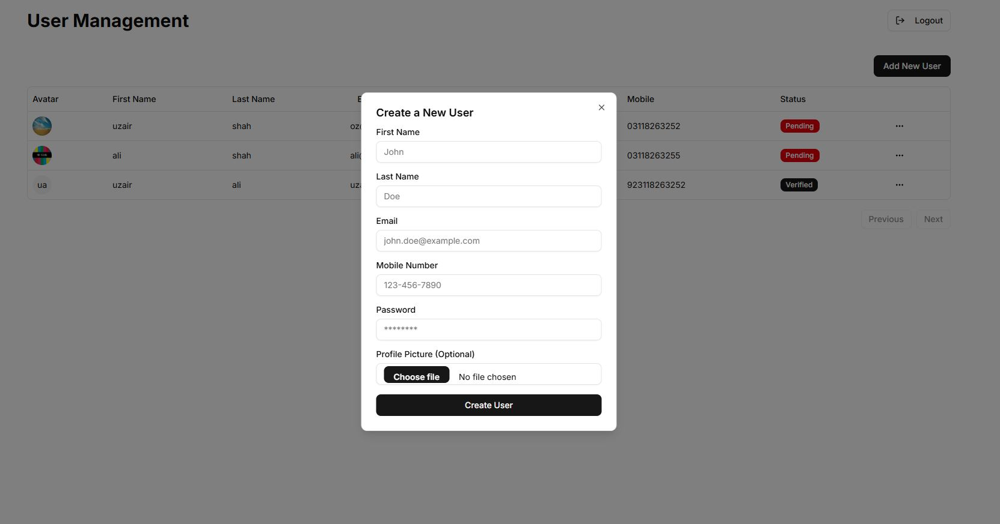
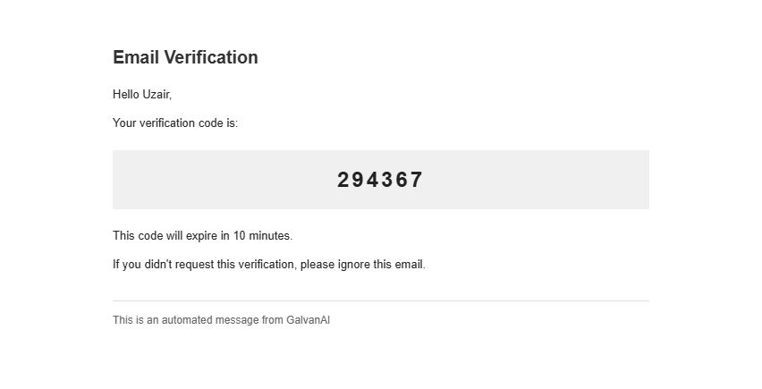
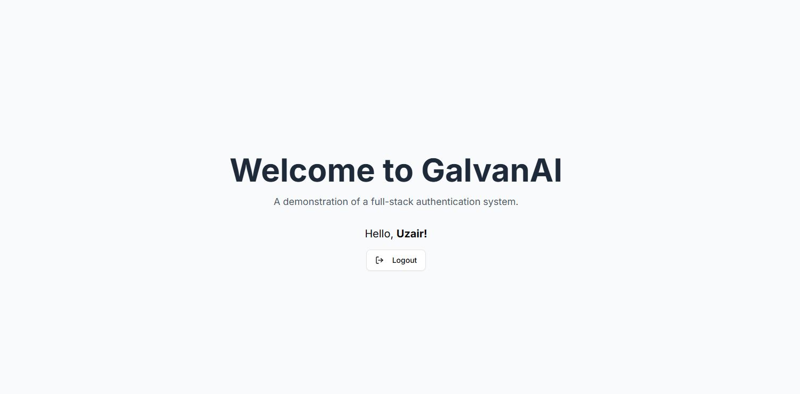

# GalvanAI – Full-Stack Authentication System

A full-stack application that pairs a Flask REST API with a Next.js front-end to provide a role-based (Super Admin / User) authentication system secured with JWTs and email-OTP verification.

---

## 🔑 Default Super Admin Login

| Email                    | Password      |
| ------------------------ | ------------- |
| `admin@galvanai.com` | `Admin@123456` |

---

## ✨ Features

* **User Authentication** – secure registration & login with email / password  
* **OTP Verification** – email-based one-time password for new-user confirmation  
* **Token Management** – JWT access and refresh tokens  
* **Role-Based Access**  
  * **Super Admin** – predefined credentials, full user management  
  * **User** – personal dashboard access only  
* **Admin Dashboard** – clean UI to **View ∙ Create ∙ Edit ∙ Delete** users  

---

## 🛠️ Tech Stack

* **Backend** – Python, Flask, Flask-RESTX, SQLAlchemy, Flask-Migrate, PyJWT, Flask-Mail  
* **Frontend** – Next.js, React, TypeScript, Tailwind CSS, shadcn/ui, Axios, Zod  
* **Database** – SQLite  

---

## 📸 Screenshots

| Front Page | Super Admin Login | Super Admin Dashboard |
| :---: | :---: | :---: |
|  |  |  |

| Add New User | Email OTP | User Login & Dashboard |
| :---: | :---: | :---: |
|  |  |  |

---

## 🚀 Getting Started

Follow these steps to run the project locally.

### Prerequisites

* **Python** 3.8 +  
* **Node.js** 18 + (includes **npm**)  
* **Git**

---

### 1 ▪ Clone the repository

```bash
git clone https://github.com/Uzair-G-Shah/galvanai-auth-system.git
cd galvanai-auth-system

```

2 ▪ Backend Setup (Flask)
All backend commands are executed from the project root (galvanai-auth-system).  if root folder is causing problem change the nam e of the root folder to GalvanAi 


- 2.1 Create a virtual environment


# Windows

```bash
python -m venv backend\venv
.\backend\venv\Scripts\activate
```
# macOS / Linux

```bash
python3 -m venv backend/venv
.\backend\venv\Scripts\Activate
```
e.g :  E:\GalvanAi> .\backend\venv\Scripts\Activate

The prompt should now display (venv).


2.2 Install dependencies
```bash
pip install Flask Flask-RESTX Flask-SQLAlchemy Flask-Migrate Flask-Bcrypt PyJWT python-dotenv Flask-CORS Pillow flask-mail
```


2.3 Configure environment variables
- Copy you .env.example to the .env file and fill it with the required things 
```bash

cd backend
# Windows
copy .env.example .env
# macOS / Linux
cp .env.example .env

```
Environment variables Should look like this : 

- SECRET_KEY=your-secret-key-here-change-this-in-production
- JWT_SECRET_KEY=your-jwt-secret-key-here-change-this
- DATABASE_URL=sqlite:///app.db

- MAIL_SERVER=smtp.gmail.com
- MAIL_PORT=587
- MAIL_USE_TLS=True
- MAIL_USERNAME=your-email@gmail.com
- MAIL_PASSWORD=your-app-specific-password
- MAIL_DEFAULT_SENDER=your-email@gmail.com

UPLOAD_FOLDER=uploads
MAX_CONTENT_LENGTH=16777216

- SUPER_ADMIN_EMAIL=admin@galvanai.com
- SUPER_ADMIN_PASSWORD=Admin@123456
- SUPER_ADMIN_FIRST_NAME=Super
- SUPER_ADMIN_LAST_NAME=Admin
- Generate secure keys inside the activated venv:


# Python backend 


Generate a hex keys for ,
- SECRET_KEY=your-secret-key-here-change-this-in-production
- JWT_SECRET_KEY=your-jwt-secret-key-here-change-this

Powershell command :
```bash
python -c "import secrets; print(secrets.token_hex(32))"
```
Powershell command :
```bash
python -c "import secrets; print(secrets.token_urlsafe(32))"
```

Set them as environment variables in the current venv PowerShell session
Replace the sample outputs below with the strings the Python commands produced:


$env:SECRET_KEY = "PASTE_FIRST_GENERATED_KEY_HERE"
$env:JWT_SECRET_KEY = "PASTE_SECOND_GENERATED_KEY_HERE"

Verify:

Powershell command :
```bash
echo $env:SECRET_KEY
echo $env:JWT_SECRET_KEY
 

```

For the gmail pass key .
MAIL_PASSWORD must be a Gmail App Password (enable 2-Step Verification → create App Password).

Return to the project and add it in the .env folder of backend e.g : MAIL_PASSWORD= 16_digit pass key


2.4 Initialise database & create Super Admin
```bash
flask db init
flask db migrate -m "Initial migration"
flask db upgrade
flask create-super-admin 

```
2.5 Run the backend server

```bash
flask run --host 0.0.0.0 --port 5000 --debug


```
(Note :API is now live at http://localhost:5000.)

3 ▪ Frontend Setup (Next.js)
Open a new terminal window:

```bash

cd frontend
npm install
npm run dev
```

Frontend is served at http://localhost:3000.

You now have:

Backend – http://localhost:5000
Frontend – http://localhost:3000

