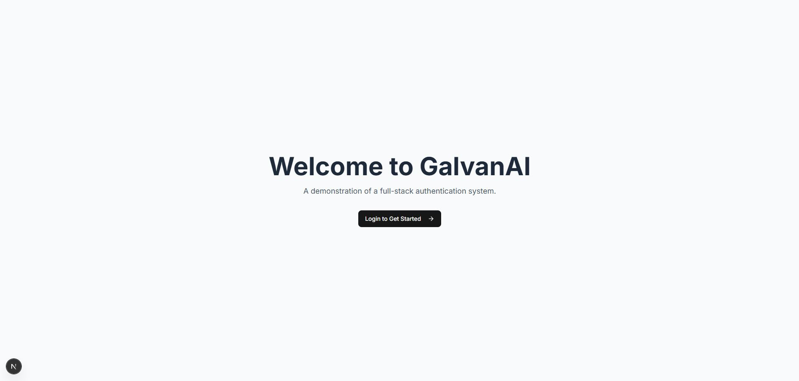

# GalvanAI - Full-Stack Authentication System

A full-stack application featuring a role-based authentication system with a Flask backend and a Next.js frontend.

## 🔑 Default Super Admin Login

-   **Email**: `admin@galvanai.com`
-   **Password**: `Admin@123456`

---

## ✨ Features

-   **User Authentication**: Secure Login & Registration with email/password.
-   **OTP Verification**: Email-based One-Time Password verification for new users.
-   **Token Management**: Uses JWT for secure access and refresh tokens.
-   **Role-Based Access**:
    -   **Super Admin**: Pre-defined credentials, can manage all users.
    -   **User**: Can log in and access their own dashboard.
-   **Admin Dashboard**: A clean UI for the Super Admin to View, Create, Edit, and Delete users.

---

## 🛠️ Tech Stack

-   **Backend**: Python, Flask, Flask-RESTX, SQLAlchemy, Flask-Migrate, PyJWT, Flask-Mail
-   **Frontend**: Next.js, React, TypeScript, Tailwind CSS, shadcn/ui, Axios, Zod
-   **Database**: SQLite

---

## 📸 Screenshots

| Front Page | Super Admin Login | Super Admin Dashboard |
| :---: | :---: | :---: |
|  |  |  |

| Add New User | Email OTP | User Login & Dashboard |
| :---: | :---: | :---: |
|  |  |  |

---

## 🚀 Getting Started

Follow these instructions to get the project running on your local machine.

### Prerequisites

-   **Python** (3.8 or newer)
-   **Node.js** (v18 or newer) & **npm**
-   **Git**

### 1. Clone the Repository

```bash
git clone [https://github.com/your-username/galvanai-auth-system.git](https://github.com/your-username/galvanai-auth-system.git)
cd galvanai-auth-system
2. Backend Setup (Flask)
Navigate to the backend directory:

Bash

cd backend
Create and activate a virtual environment:

On Windows:

Bash

python -m venv venv
.\venv\Scripts\activate
On macOS/Linux:

Bash

python3 -m venv venv
source venv/bin/activate
Install dependencies from the requirements file:

Bash

pip install -r requirements.txt
Set up environment variables:

In the backend folder, copy the example file:

On Windows: copy .env.example .env

On macOS/Linux: cp .env.example .env

Open the new .env file and fill in your values. It should look like this:

Ini, TOML

SECRET_KEY=your-secret-key-here-change-this-in-production
JWT_SECRET_KEY=your-jwt-secret-key-here-change-this
DATABASE_URL=sqlite:///app.db
MAIL_SERVER=smtp.gmail.com
MAIL_PORT=587
MAIL_USE_TLS=True
MAIL_USERNAME=your-email@gmail.com
MAIL_PASSWORD=your-app-specific-password
MAIL_DEFAULT_SENDER=your-email@gmail.com
UPLOAD_FOLDER=uploads
MAX_CONTENT_LENGTH=16777216
SUPER_ADMIN_EMAIL=admin@galvanai.com
SUPER_ADMIN_PASSWORD=Admin@123456
SUPER_ADMIN_FIRST_NAME=Super
SUPER_ADMIN_LAST_NAME=Admin
How to Get Your Secret Keys & Credentials
SECRET_KEY & JWT_SECRET_KEY: Generate these in your terminal. With your virtual environment active, run python, then enter:

```python
import secrets
secrets.token_hex(24)
```
Copy the output and paste it as the value. Do this twice, once for each key.
MAIL_PASSWORD: This must be a Gmail App Password, not your regular password.

1.  Go to your Google Account -\> Security.
2.  Enable **2-Step Verification**.
3.  Go to **App Passwords**, generate a new one for "Mail" on "Other".
4.  Copy the **16-digit code** and paste it as the value for `MAIL_PASSWORD`.
Initialize the database and create the admin:

Bash

flask db init
flask db migrate -m "Initial migration"
flask db upgrade
flask create-super-admin
(Note: flask db init is only needed the very first time.)

Run the backend server:

Bash

flask run --host=0.0.0.0 --port=5000 --debug
The backend API will be running at http://localhost:5000.

3. Frontend Setup (Next.js)
Open a new terminal and navigate to the frontend directory from the project root:

Bash

cd frontend
Install dependencies:

Bash

npm install
Run the frontend server:

Bash

npm run dev
The application will be accessible at http://localhost:3000.


***